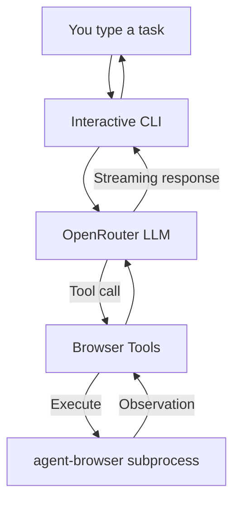

# Browser Agent

LLM-powered CLI tool for browser automation using `agent-browser`. Simply describe your task in natural language, and the AI will browse the web and perform actions to accomplish it.

## Features

- Interactive chat-style terminal UI with streaming responses
- Powered by OpenRouter (works with any LLM provider)
- Uses `agent-browser` for reliable browser automation
- Session logging to `./runs/` for debugging
- Commands: `/help`, `/exit`, `/reset`, `/debug on|off`
- Cross-platform support (Windows, macOS, Linux)
- Windows WSL detection and guidance

## Prerequisites

1. **Python 3.10+**
2. **Node.js** (for `agent-browser`)
3. **OpenRouter API key**

## Installation

### 1. Install Dependencies

#### macOS / Linux / WSL

```bash
# Install Node.js (if not already installed)
curl -fsSL https://deb.nodesource.com/setup_lts.x | sudo -E bash -
sudo apt install -y nodejs

# Install agent-browser
npm install -g agent-browser

# Download Chromium browser
agent-browser install

# Install browser-agent
pip install -e .
```

#### Windows

**Important**: For full compatibility, use WSL or Git Bash.

**Using WSL (Recommended)**:

```bash
# Install WSL in PowerShell (run as Administrator)
wsl --install

# After WSL is set up, open WSL terminal and run:
curl -fsSL https://deb.nodesource.com/setup_lts.x | sudo -E bash -
sudo apt install -y nodejs
npm install -g agent-browser
agent-browser install
pip install -e .
```

**Using Git Bash**:

```bash
# Install Node.js from https://nodejs.org/
# Open Git Bash and run:
npm install -g agent-browser
agent-browser install
pip install -e .
```

### 2. Configure API Key

Set your OpenRouter API key:

```bash
# Option 1: Environment variable
export OPENROUTER_API_KEY="your-api-key-here"

# Option 2: Create .env file
echo "OPENROUTER_API_KEY=your-api-key-here" > .env
```

Get your API key from [openrouter.ai/keys](https://openrouter.ai/keys).

## Usage

### Basic Usage

Run the CLI:

```bash
browser-agent
```

You'll see an interactive prompt:

```
> 
```

Type your task and press Enter:

```
> Find the pricing page for Vercel and summarize the key tiers
```

The AI will:
1. Navigate to the website
2. Browse and interact with pages
3. Extract information
4. Provide a summary

### Commands

- `/help` - Show available commands
- `/exit` - Exit the CLI
- `/reset` - Clear conversation history (next message starts fresh)
- `/debug on` - Enable debug mode (show tool calls and API details)
- `/debug off` - Disable debug mode

### Examples

```bash
# Navigate and extract
> Open example.com and tell me what's on the page

# Search and find
> Search for "Python tutorials" and list the top 3 results

# Multi-step task
> Go to GitHub, search for "react", and tell me the most popular repository this week

# Form interaction
> Go to a contact form, fill it with test data, and submit
```

### Options

```bash
# Use a specific model
browser-agent --model anthropic/claude-sonnet-4

# Enable debug mode
browser-agent --debug

# Specify API key (overrides env var)
browser-agent --api-key "your-api-key"

# Show version
browser-agent --version
```

### Available Models

Browser agent works with any model on OpenRouter. Some recommended options:

- `anthropic/claude-sonnet-4` (default)
- `openai/gpt-4o`
- `google/gemini-pro-1.5`
- `meta-llama/llama-3.1-70b-instruct`

Set the model via environment variable:

```bash
export OPENROUTER_MODEL="openai/gpt-4o"
```

## How It Works



1. You describe a task in natural language
2. The LLM decides what browser actions to take
3. Tools execute via `agent-browser` subprocess
4. Results are fed back to the LLM
5. The LLM responds with the final answer

## Session Logging

All sessions are logged to `./runs/<timestamp>/`:

```
runs/
├── 20240119_143022/
│   ├── session.jsonl      # Full conversation transcript
│   └── agent-browser.log  # Raw browser output
```

View a session:

```bash
# View the session transcript
cat runs/20240119_143022/session.jsonl | jq

# View browser logs
cat runs/20240119_143022/agent-browser.log
```

## Architecture

- `src/cli.py` - Interactive terminal UI with rich + prompt_toolkit
- `src/openrouter.py` - OpenRouter streaming client
- `src/tools.py` - Tool definitions and JSON schemas
- `src/agent_browser.py` - Subprocess wrapper for agent-browser
- `src/controller.py` - Agent orchestration loop
- `src/logger.py` - Session transcript logging
- `src/platform_check.py` - Platform and shell detection

## Testing

Run tests:

```bash
# Install test dependencies
pip install -e ".[dev]"

# Run all tests
pytest

# Run with coverage
pytest --cov=src

# Run specific test file
pytest tests/test_tools.py
```

## Troubleshooting

### "agent-browser not found"

Install agent-browser globally:

```bash
npm install -g agent-browser
agent-browser install
```

### "OpenRouter API key not found"

Set the environment variable:

```bash
export OPENROUTER_API_KEY="your-key-here"
```

Or create a `.env` file:

```
OPENROUTER_API_KEY=your-key-here
```

### Windows PowerShell Error

PowerShell is not fully supported. Use WSL or Git Bash:

```bash
# Install WSL
wsl --install

# Or use Git Bash (comes with Git for Windows)
```

### Browser Action Timeout

If actions timeout, try:

1. Check your internet connection
2. Verify `agent-browser` is working: `agent-browser --version`
3. Try with debug mode: `browser-agent --debug`

### "Module not found" Error

Ensure you installed the package:

```bash
pip install -e .
```

## Development

### Project Structure

```
browser-agent/
├── src/
│   ├── __init__.py
│   ├── main.py              # CLI entrypoint
│   ├── cli.py               # Interactive UI
│   ├── openrouter.py        # OpenRouter client
│   ├── tools.py             # Tool definitions
│   ├── agent_browser.py     # agent-browser wrapper
│   ├── controller.py        # Agent loop
│   ├── logger.py            # Session logging
│   └── platform_check.py    # Platform detection
├── tests/
│   ├── test_tools.py
│   └── test_openrouter.py
├── runs/                    # Session logs
├── pyproject.toml
└── README.md
```

### Adding a New Tool

1. Define the tool in `src/tools.py` (TOOLS list)
2. Implement the method in `src/agent_browser.py`
3. Add a handler in `src/controller.py` (_run_tool method)

## License

MIT

## Contributing

Contributions welcome! Please open an issue or submit a PR.

## Acknowledgments

- Built with [agent-browser](https://github.com/vercel-labs/agent-browser) by Vercel
- Uses [OpenRouter](https://openrouter.ai) for LLM access
- UI powered by [Rich](https://rich.readthedocs.io/) and [prompt_toolkit](https://python-prompt-toolkit.readthedocs.io/)
